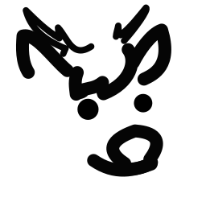

# Gulo Workshops Avatar Support
Support repo for Gulo Workshops VRC Avatars. Feel free to leave an issue here if you found a bug in the avatar bases from Gulo Workshops.

This repository also contains the manuals of the avatars from Gulo Workshops.

Everything under this is under CC0 (public domain). If you see something that could be improved in the manual, feel free to fork and submit a PR. 

[Submit a bug report](https://github.com/the-furry-hubofeverything/workshop-avatar-support/issues)

## Docs
<a href="./tankWeasel/tankWeaselV1.md">
    <picture>
        <source media="(prefers-color-scheme: dark)" srcset="./imgs/TankWeasel.png">
        <source media="(prefers-color-scheme: light)" srcset="./imgs/TankWeaselDark.png">
        
    </picture>
    
Tank weasel

</a>

<a href="./DurrV1Documentation.pdf">
    <picture>
        <source media="(prefers-color-scheme: dark)" srcset="./imgs/DurrV1.png">
        <source media="(prefers-color-scheme: light)" srcset="./imgs/DurrV1Dark.png">
        
    </picture>
    
Durr V1

</a>

---
Follow me on my socials! <https://gulo.dev>